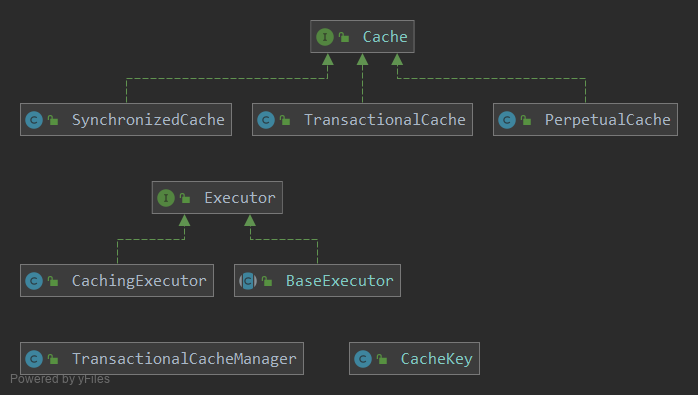

# (七)Mybatis源码阅读—一级缓存和二级缓存

在上一节我们讲解了与Mybatis缓存相关的类，这一节我们来分析Mybatis的一级缓存和二级缓存（自带）



### 一、一级缓存

BaseExecutor是Executor的一个子类，一级缓存的实现就是在该类中进行的。

**Mybatis的一级缓存是会话级别的缓存，所以它的生命周期与sqlSession相同。一级缓存是默认开启的**

#### BaseExecutor#query

```java
@Override
public <E> List<E> query(MappedStatement ms, Object parameter, RowBounds rowBounds, ResultHandler resultHandler, CacheKey key, BoundSql boundSql) throws SQLException {
    ErrorContext.instance().resource(ms.getResource()).activity("executing a query").object(ms.getId());
    if (closed) {
        throw new ExecutorException("Executor was closed.");
    }
    //flush为true，强制清除缓存
    if (queryStack == 0 && ms.isFlushCacheRequired()) {
        clearLocalCache();
    }
    List<E> list;
    try {
        queryStack++;
        //先去缓存中查，缓存命中失败再去数据库查询
        list = resultHandler == null ? (List<E>) localCache.getObject(key) : null;
        if (list != null) {
            handleLocallyCachedOutputParameters(ms, key, parameter, boundSql);
        } else {
            //从数据库下载
            list = queryFromDatabase(ms, parameter, rowBounds, resultHandler, key, boundSql);
        }
    } finally {
        queryStack--;
    }
    if (queryStack == 0) {
        for (DeferredLoad deferredLoad : deferredLoads) {
            deferredLoad.load();
        }
        deferredLoads.clear();
        if (configuration.getLocalCacheScope() == LocalCacheScope.STATEMENT) {
            clearLocalCache();
        }
    }
    return list;
}


private <E> List<E> queryFromDatabase(MappedStatement ms, Object parameter, RowBounds rowBounds, ResultHandler resultHandler, CacheKey key, BoundSql boundSql) throws SQLException {
    List<E> list;
    localCache.putObject(key, EXECUTION_PLACEHOLDER);
    try {
        list = doQuery(ms, parameter, rowBounds, resultHandler, boundSql);
    } finally {
        localCache.removeObject(key);
    }
    //将查询结果保存到缓存
    localCache.putObject(key, list);
    if (ms.getStatementType() == StatementType.CALLABLE) {
        localOutputParameterCache.putObject(key, parameter);
    }
    return list;
}
```

#### BaseExecutor#update

```java
@Override
public int update(MappedStatement ms, Object parameter) throws SQLException {
    ErrorContext.instance().resource(ms.getResource()).activity("executing an update").object(ms.getId());
    if (closed) {
        throw new ExecutorException("Executor was closed.");
    }
    //清理本地缓存
    clearLocalCache();
    //具体逻辑交给子类的doUpdate去继承重写。
    return doUpdate(ms, parameter);
}

```

可以看到，update方法不会加入缓存，且会清空本地缓存

#### BaseExecutor#commit

```java
@Override
public void commit(boolean required) throws SQLException {
    if (closed) {
        throw new ExecutorException("Cannot commit, transaction is already closed");
    }
    //清空本地缓存
    clearLocalCache();
    flushStatements();
    if (required) {
        transaction.commit();
    }
}
```

commit也会清空本地缓存

#### BaseExecutor#close

```java
@Override
public void close(boolean forceRollback) {
    try {
        try {
            rollback(forceRollback);
        } finally {
            if (transaction != null) {
                transaction.close();
            }
        }
    } catch (SQLException e) {
        // Ignore.  There's nothing that can be done at this point.
        log.warn("Unexpected exception on closing transaction.  Cause: " + e);
    } finally {
        transaction = null;
        deferredLoads = null;
        //清空
        localCache = null;
        localOutputParameterCache = null;
        closed = true;
    }
}
```

这里，执行close方法会清空本地方法

#### 总结

mybatis默认开启一级缓存，在查询的时候会先从缓存中查询，查询不到再去数据库查询，再将结果存入缓存。增删改会清空本地缓存

### 二、二级缓存

**Mybatis的二级缓存是应用级别的缓存，它的生命周期和应用的生命周期相同。**

**mybatis配置文件中的` cacheEnabled` 是默认为true的 ，所以只需要在mapper配置文件中 通过`<cache>`和`<cache-ref>`标签来管理其在namespace中二级缓存功能的开启和关闭** 

 **Mybatis 的二级缓存是用 CachingExecutor 来实现的，它是 Executor 的一个装饰器类。为 Executor 对象添加了缓存的功能。** 

在了解二级缓存怎么运作之前，我们需要了解两个和二级缓存相关的类

#### TransactionalCache

 TransactionalCache 实现了 Cache 接口，主要用于保存在某个 SqlSession 的某个事务中需要向某个二级缓存中添加的数据

```java
public class TransactionalCache implements Cache {

    private static final Log log = LogFactory.getLog(TransactionalCache.class);
	//二级缓存对象
    private final Cache delegate;
    //为true时，表示当前TransactionalCache不可查询，提交事务会清空缓存
    private boolean clearOnCommit;
    //存放需要添加到二级缓存的数据
    private final Map<Object, Object> entriesToAddOnCommit;
    //存放命中缓存的数据
    private final Set<Object> entriesMissedInCache;

    public TransactionalCache(Cache delegate) {
        this.delegate = delegate;
        this.clearOnCommit = false;
        this.entriesToAddOnCommit = new HashMap<>();
        this.entriesMissedInCache = new HashSet<>();
    }

    @Override
    public String getId() {
        return delegate.getId();
    }

    @Override
    public int getSize() {
        return delegate.getSize();
    }

    @Override
    public Object getObject(Object key) {
        // issue #116
        Object object = delegate.getObject(key);
        if (object == null) {
            entriesMissedInCache.add(key);
        }
        // issue #146
        if (clearOnCommit) {
            return null;
        } else {
            //缓存命中
            return object;
        }
    }

    @Override
    public void putObject(Object key, Object object) {
        entriesToAddOnCommit.put(key, object);
    }

    @Override
    public Object removeObject(Object key) {
        return null;
    }

    @Override
    public void clear() {
        clearOnCommit = true;
        entriesToAddOnCommit.clear();
    }

    //提交事务
    public void commit() {
        if (clearOnCommit) {
            delegate.clear();
        }
        //把entriesToAddOnCommit集合中的数据提交到二级缓存
        flushPendingEntries();
        reset();
    }
	//回滚事务
    public void rollback() {
        unlockMissedEntries();
        reset();
    }
	
    private void reset() {
        clearOnCommit = false;
        entriesToAddOnCommit.clear();
        entriesMissedInCache.clear();
    }

    //
    private void flushPendingEntries() {
        for (Map.Entry<Object, Object> entry : entriesToAddOnCommit.entrySet()) {
            delegate.putObject(entry.getKey(), entry.getValue());
        }
        for (Object entry : entriesMissedInCache) {
            if (!entriesToAddOnCommit.containsKey(entry)) {
                delegate.putObject(entry, null);
            }
        }
    }

    private void unlockMissedEntries() {
        for (Object entry : entriesMissedInCache) {
            try {
                delegate.removeObject(entry);
            } catch (Exception e) {
                log.warn("Unexpected exception while notifiying a rollback to the cache adapter."
                         + "Consider upgrading your cache adapter to the latest version.  Cause: " + e);
            }
        }
    }

}

```

#### TransactionalCacheManager

`TransactionalCacheManager`主要是用于管理二级缓存

```java
public class TransactionalCacheManager {

   	 //用来管理 CachingExecutor 使用的二级缓存
 	 // key 为对应的CachingExecutor 使用的二级缓存
 	 // value 为对应的 TransactionalCache 对象
    private final Map<Cache, TransactionalCache> transactionalCaches = new HashMap<>();

    public void clear(Cache cache) {
        getTransactionalCache(cache).clear();
    }

    public Object getObject(Cache cache, CacheKey key) {
        return getTransactionalCache(cache).getObject(key);
    }

    public void putObject(Cache cache, CacheKey key, Object value) {
        getTransactionalCache(cache).putObject(key, value);
    }

    public void commit() {
        for (TransactionalCache txCache : transactionalCaches.values()) {
            txCache.commit();
        }
    }

    public void rollback() {
        for (TransactionalCache txCache : transactionalCaches.values()) {
            txCache.rollback();
        }
    }

    private TransactionalCache getTransactionalCache(Cache cache) {
        return transactionalCaches.computeIfAbsent(cache, TransactionalCache::new);
    }

}
```

#### CachingExecutor#query

```java
@Override
public <E> List<E> query(MappedStatement ms, Object parameterObject, RowBounds rowBounds, ResultHandler resultHandler, CacheKey key, BoundSql boundSql)
    throws SQLException {
    // 获取查询语句所在namespace对应的二级缓存
    Cache cache = ms.getCache();
    // 是否开启了二级缓存
    if (cache != null) {
        // 根据 <select> 的属性 useCache 的配置，决定是否需要清空二级缓存
        flushCacheIfRequired(ms);
        if (ms.isUseCache() && resultHandler == null) {
            // 二级缓存不能保存输出参数，否则抛异常
            ensureNoOutParams(ms, boundSql);
            // 从二级缓存中查询对应的值
            @SuppressWarnings("unchecked")
            List<E> list = (List<E>) tcm.getObject(cache, key);
            if (list == null) {
                // 如果二级缓存没有命中，则调用底层的 Executor 查询，其中会先查询一级缓存，一级缓存也未命中，才会去查询数据库
                list = delegate.query(ms, parameterObject, rowBounds, resultHandler, key, boundSql);
                // 查询到的数据放入到二级缓存中去
                tcm.putObject(cache, key, list); // issue #578 and #116
            }
            return list;
        }
    }
    return delegate.query(ms, parameterObject, rowBounds, resultHandler, key, boundSql);
}
```

#### 总结

二级取消了sqlsession独立的缓存，取代之的是根据namespace来创建的多个缓存容器，也就是说不管多少个sqlsession，只要执行mapper的namespace一样会使用同一个容器，默认不开启，需要在myabtis的配置处开启，并且在mapper里的xml文件里配置好缓存策略，由于二级缓存是每一个namespace一个容器，所以连表查询时无法使用，需要在mapper里通过Cache ref标签关联另外一个namespace，否则无法感应出其他表数据的变化导致读脏数据。

和一级缓存一样查询不会刷新缓存，增删改会刷新缓存数据。

二级缓存可以使用第三方缓存

### 三、注意事项

#### 1.一级缓存

-  Mybatis一级缓存的生命周期和SqlSession一致
-  Mybatis的缓存是一个粗粒度的缓存，没有更新缓存和缓存过期的概念，同时只是使用了默认的hashmap，也没有做容量上的限定
-  Mybatis的一级缓存最大范围是SqlSession内部，有多个SqlSession或者分布式的环境下，有操作数据库写的话，会引起脏数据，建议是把一级缓存的默认级别设定为Statement，即不使用一级缓存
-  对于数据变化频率很大，并且需要高时效准确性的数据要求，我们使用**SqlSession**查询的时候，要控制好**SqlSession**的生存时间，**SqlSession**的生存时间越长，它其中缓存的数据有可能就越旧，从而造成和真实数据库的误差；同时对于这种情况，用户也可以手动地适时清空**SqlSession**中的缓存； 

#### 2.二级缓存

-  Mybatis的二级缓存相对于一级缓存来说，实现了SqlSession之间缓存数据的共享，同时粒度更加的细，能够到Mapper级别，通过Cache接口实现类不同的组合，对Cache的可控性也更强。 
-   Mybatis在多表查询时，极大可能会出现脏数据，有设计上的缺陷，安全使用的条件比较苛刻。 
-  在分布式环境下，由于默认的Mybatis Cache实现都是基于本地的，分布式环境下必然会出现读取到脏数据，需要使用集中式缓存将Mybatis的Cache接口实现，有一定的开发成本，不如直接用Redis，Memcache实现业务上的缓存就好了。 


