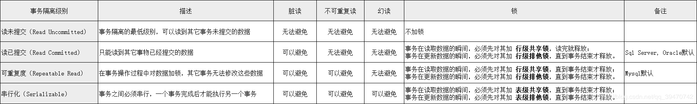
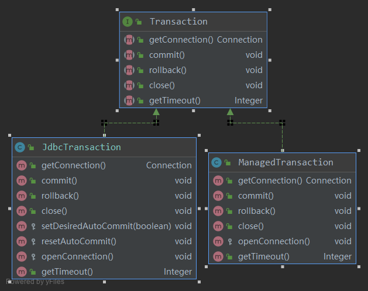

# (五)Mybatis源码阅读—事务管理

上一小节我们知道，mybatis会使用事务来获取connection连接，那么什么是事务？事务的作用又是什么？这一小节我们就这个问题展开讨论。

### 一、什么是事务

指作为单个逻辑工作单元执行的一系列操作，要么完全地执行，要么完全地不执行。简单的说，事务就是并发控制的单位，是用户定义的一个操作序列。而一个逻辑工作单元要成为事务，就必须满足ACID属性。 

- **原子性(Atomicity)**：事务中的操作要么什么都不做，要么全做
- **一致性(Consistency)**：事务执行的结果必须是从一个一致性状态转换到另一个一致性状态。 当数据库只包含成功事务提交的结果时，就说数据库处于一致性状态。如果数据库系统 运行中发生故障，有些事务尚未完成就被迫中断，这些未完成事务对数据库所做的修改有一部分已写入物理数据库，这时数据库就处于一种不正确的状态，或者说是 不一致的状态。  
- **隔离性(Isolation)**：一个事务的执行不能被其他事务干扰
- **持久性(Durability)**：一个事务一旦提交，他对数据库的改变应该是永久性的

### 二、事务的并发问题

如果不考虑事务的隔离性，那么会发生以下三种问题

#### （一）脏读(Dirty Read)

- 简介

  一个事务读取了已被另一个事务修改、但尚未提交的数据。当一个事务在正在多次修改某个数据，而这些修改都还未提交，这时另外一个并发的事务来访问该数据，就会造成两个事务得到的数据不一致。

- 举例

  用户A向用户B转账100元，对应sqL命令如下所示：

  `UPDATE ACCOUNT  SET  MONEY= MONEY+100 WHERE NAME='B'`

  `UPDATE ACCOUNT SET MONEY = MONEY-100 WHERE NAME='A'`

  当只执行第一条Sql时，A通知B查看账户，B发现钱确实已到账（此时即发生了脏读），而之后无论第二条sL是否执行，只要该事务不提交，所有操作就都将回滚，那么当B以后再次查看账户时就会发现钱其实并没有转成功。

#### （二）不可重复读(Norepeatable Read)

- 简介

   不可重复读是指同一事物内的两次相同的查询操作读取到了不同的数据

- 举例

  事务1在读取某一行数据，而事务此时立即修改了数据并且提交给数据库，事务1再次读取该行数据时，就得到了不同的结果，这是就发生了不可重复读。

#### （三）幻读(Phantom Read)

- 简介

  在同一事务中，当同一查询多次执行的时候，由于其他事务insert操作的事务提交，会导致每次返回不同的结果集。

- 举例

   事务A提交了一次更新操作，此时事务B新插入了一条数据，之后事务A查看数据会发现有一条数据没有更新，仿佛出现了幻觉。 

  

**1. 不可重复读和幻读都是一个事务A读取了事务B提交之后的数据，而脏读是指事务A读取了事务B没有提交的数据。**
**2.不可重复读和幻读有些相似，容易出现混淆。不可重复读侧重于另一事务的修改操作，幻读侧重于另一事务的增加和删除操作。不可重复读的避免需要行锁，幻读需要表锁。** 

### 三、事务的隔离级别



### 四、Mybatis事务

讲完了事务的基本知识，我们回到Mybatis上来，首先我们需要知道的是，**mybatis自己并不处理事务，只是做了一层封装，方便调用**。Mybatis为我们提供了两种管理事务的方式。

#### （一）配置文件

```xml
<environments default="development">
    <environment id="development">
        //JDBC的事务方式
        <transactionManager type="JDBC" />
        <dataSource type="POOLED">
            <property name="driver" value="${driver}" />
            <property name="url" value="${url}" />
            <property name="username" value="${username}" />
            <property name="password" value="${password}" />
        </dataSource>
    </environment>
</environments>
```

#### （二）相关类解析



##### 1.TransactionIsolationLevel

TransactionIsolationLevel是JdbcTransaction和ManagedTransaction中都有一个枚举类型的属性，它对应的就是事务的隔离级别

```java
/**
    事务隔离级别
*/
public enum TransactionIsolationLevel {
    NONE(Connection.TRANSACTION_NONE),//不要求事务管理     0
    READ_COMMITTED(Connection.TRANSACTION_READ_COMMITTED), //已提交读  1
    READ_UNCOMMITTED(Connection.TRANSACTION_READ_UNCOMMITTED), //未提交读  2
    REPEATABLE_READ(Connection.TRANSACTION_REPEATABLE_READ),//可重复读   4
    SERIALIZABLE(Connection.TRANSACTION_SERIALIZABLE);//可串行化    8

    private final int level;

    private TransactionIsolationLevel(int level) {
        this.level = level;
    }

    public int getLevel() {
        return level;
    }
}
```


##### 2.JdbcTransaction

JdbcTransaction直接使用JDBC的提交和回滚事务管理机制 。它依赖与从dataSource中取得的连接connection 来管理transaction 的作用域，connection对象的获取被延迟到调用getConnection()方法。如果autocommit设置为on，开启状态的话，它会忽略commit和rollback。

直观地讲，就是JdbcTransaction是使用的java.sql.Connection 上的commit和rollback功能，JdbcTransaction只是相当于对java.sql.Connection事务处理进行了一次包装（wrapper），Transaction的事务管理都是通过java.sql.Connection实现的。

```java
public class JdbcTransaction implements Transaction {

    private static final Log log = LogFactory.getLog(JdbcTransaction.class);

    protected Connection connection;
    protected DataSource dataSource;
    protected TransactionIsolationLevel level;
    protected boolean autoCommit;

    public JdbcTransaction(DataSource ds, TransactionIsolationLevel desiredLevel, boolean desiredAutoCommit) {
        dataSource = ds;
        level = desiredLevel;
        autoCommit = desiredAutoCommit;
    }

    public JdbcTransaction(Connection connection) {
        this.connection = connection;
    }

    @Override
    public Connection getConnection() throws SQLException {
        if (connection == null) {
            openConnection();
        }
        return connection;
    }

    @Override
    public void commit() throws SQLException {
        if (connection != null && !connection.getAutoCommit()) {
            if (log.isDebugEnabled()) {
                log.debug("Committing JDBC Connection [" + connection + "]");
            }
            connection.commit();
        }
    }

    @Override
    public void rollback() throws SQLException {
        if (connection != null && !connection.getAutoCommit()) {
            if (log.isDebugEnabled()) {
                log.debug("Rolling back JDBC Connection [" + connection + "]");
            }
            connection.rollback();
        }
    }

    @Override
    public void close() throws SQLException {
        if (connection != null) {
            resetAutoCommit();
            if (log.isDebugEnabled()) {
                log.debug("Closing JDBC Connection [" + connection + "]");
            }
            connection.close();
        }
    }

    protected void setDesiredAutoCommit(boolean desiredAutoCommit) {
        try {
            if (connection.getAutoCommit() != desiredAutoCommit) {
                if (log.isDebugEnabled()) {
                    log.debug("Setting autocommit to " + desiredAutoCommit + " on JDBC Connection [" + connection + "]");
                }
                connection.setAutoCommit(desiredAutoCommit);
            }
        } catch (SQLException e) {
            // Only a very poorly implemented driver would fail here,
            // and there's not much we can do about that.
            throw new TransactionException("Error configuring AutoCommit.  "
                                           + "Your driver may not support getAutoCommit() or setAutoCommit(). "
                                           + "Requested setting: " + desiredAutoCommit + ".  Cause: " + e, e);
        }
    }

    protected void resetAutoCommit() {
        try {
            if (!connection.getAutoCommit()) {
                // MyBatis does not call commit/rollback on a connection if just selects were performed.
                // Some databases start transactions with select statements
                // and they mandate a commit/rollback before closing the connection.
                // A workaround is setting the autocommit to true before closing the connection.
                // Sybase throws an exception here.
                if (log.isDebugEnabled()) {
                    log.debug("Resetting autocommit to true on JDBC Connection [" + connection + "]");
                }
                connection.setAutoCommit(true);
            }
        } catch (SQLException e) {
            if (log.isDebugEnabled()) {
                log.debug("Error resetting autocommit to true "
                          + "before closing the connection.  Cause: " + e);
            }
        }
    }

    protected void openConnection() throws SQLException {
        if (log.isDebugEnabled()) {
            log.debug("Opening JDBC Connection");
        }
        //通过dataSource.getConnection()获取连接
        connection = dataSource.getConnection();
        if (level != null) {
            connection.setTransactionIsolation(level.getLevel());
        }
        setDesiredAutoCommit(autoCommit);
    }

    @Override
    public Integer getTimeout() throws SQLException {
        return null;
    }

}

```


##### 3.ManagedTransaction

 ManagedTransaction让容器来管理事务Transaction的整个生命周期，意思就是说，使用ManagedTransaction的commit和rollback功能不会对事务有任何的影响，它什么都不会做，它将事务管理的权利移交给了容器来实现。

```java
public  class ManagedTransaction implements Transaction{

    private static final Log log = LogFactory.getLog(ManagedTransaction.class);

    private DataSource dataSource;
    private TransactionIsolationLevel level;
    private Connection connection;
    private final boolean closeConnection;

    public ManagedTransaction(Connection connection, boolean closeConnection) {
        this.connection = connection;
        this.closeConnection = closeConnection;
    }

    public ManagedTransaction(DataSource ds, TransactionIsolationLevel level, boolean closeConnection) {
        this.dataSource = ds;
        this.level = level;
        this.closeConnection = closeConnection;
    }

    @Override
    public Connection getConnection() throws SQLException {
        if (this.connection == null) {
            openConnection();
        }
        return this.connection;
    }

    @Override
    public void commit() throws SQLException {
        // Does nothing
    }

    @Override
    public void rollback() throws SQLException {
        // Does nothing
    }

    @Override
    public void close() throws SQLException {
        if (this.closeConnection && this.connection != null) {
            if (log.isDebugEnabled()) {
                log.debug("Closing JDBC Connection [" + this.connection + "]");
            }
            this.connection.close();
        }
    }

    protected void openConnection() throws SQLException {
        if (log.isDebugEnabled()) {
            log.debug("Opening JDBC Connection");
        }
        this.connection = this.dataSource.getConnection();
        if (this.level != null) {
            this.connection.setTransactionIsolation(this.level.getLevel());
        }
    }

    @Override
    public Integer getTimeout() throws SQLException {
        return null;
    }

}

```

